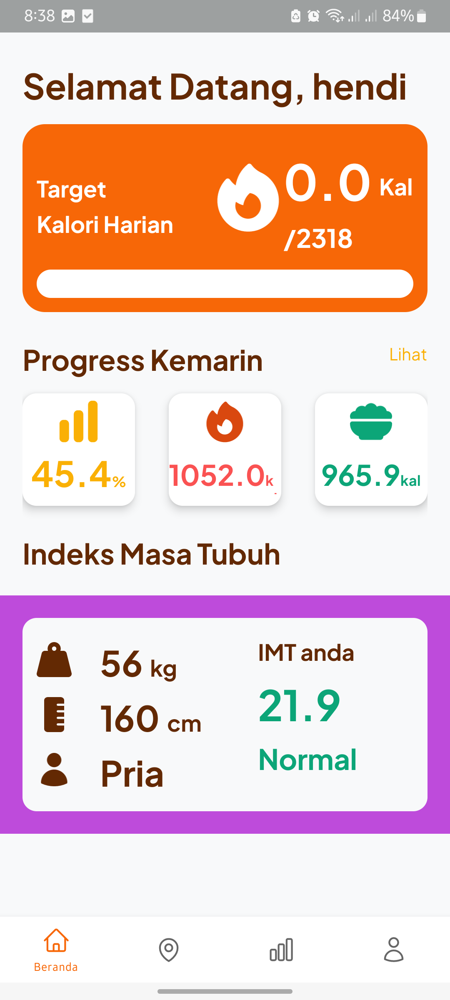
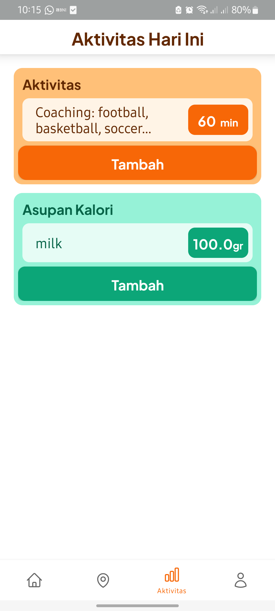
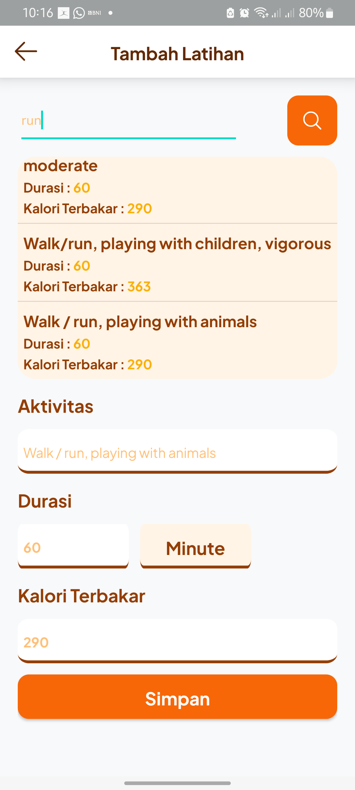

# 📱 FitTrack (Aplikasi Monitoring Kebugaran Tubuh)

Aplikasi mobile untuk melakukan **monitoring dan pencatatan aktifitas dan makanan sehari hari** untuk mengetahui tingkat kebugaran seseorang.  
Dibangun dengan **Kotlin** dan **Laravel backend**.

---

## 🚀 Features
- Monitor progress harian
- Menambah daftar aktifitas
- Menambah daftar konsumsi makanan
- Data diambil dari ninja API
- Informasi untuk saran kesehatan

---

## 🖼️ Screenshot
<p align="center">
  
  
  
</p>

---

## 🎥 Demo Video
<p align="center">
  <a href="https://drive.google.com/file/d/1SVyz6IUAEB9sLoyLphEYRExWru6Yuwsi/view?usp=sharing" target="_blank">
    
  </a>
</p>

---

## ⚙️ Tech Stack
- **Frontend (Mobile)**: Kotlin + xml + ninjaAPI
- **Backend**: Laravel
- **Database**: MySQL

---

## 📦 Installation
```bash
# Clone repository
git clone https://github.com/AhmadSholehU/FitTrack.git

# Masuk ke folder project
cd FitTrack
```

---

## 👨‍💻 Author
- [Hendi Ahmad](https://github.com/AhmadSholehU)
